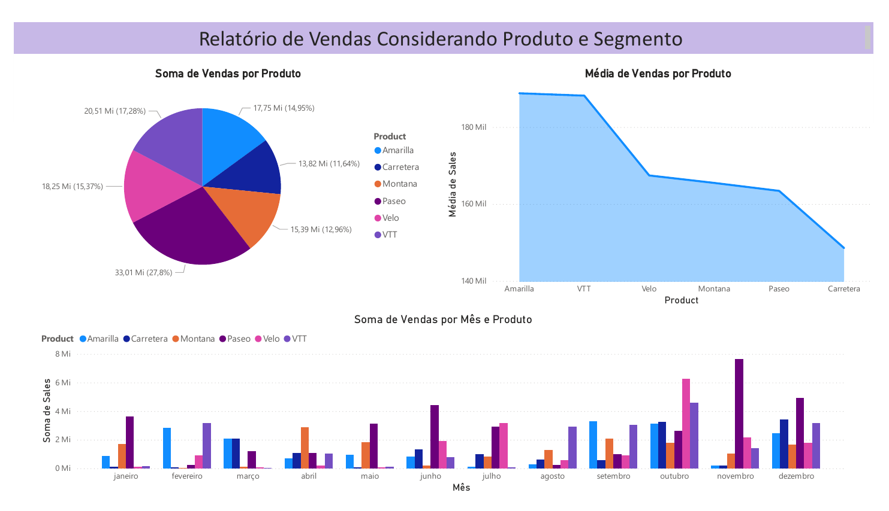
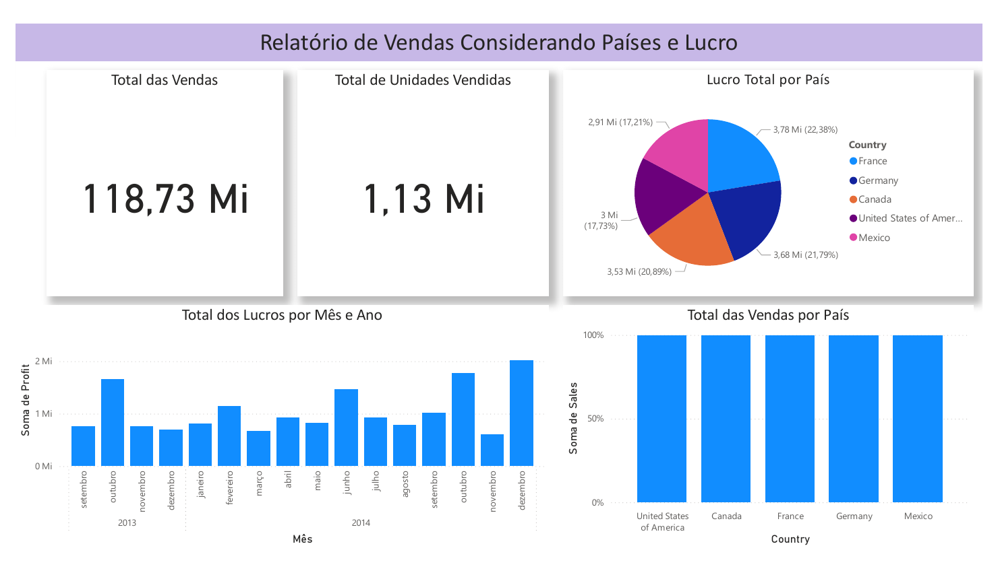
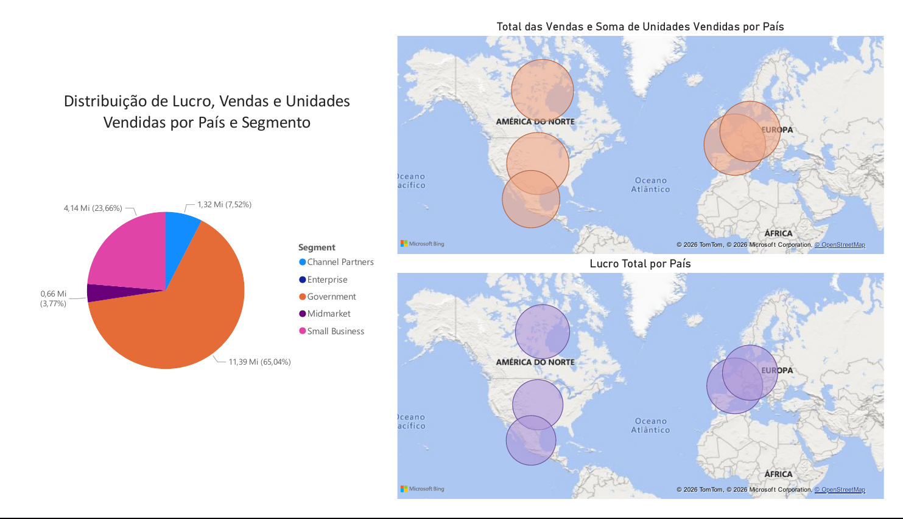

# Relatório de Vendas e Lucro com Power BI

Este repositório apresenta o projeto final desenvolvido para o desafio **"Analisando Dados de um Dashboard de Vendas no Power BI"**, parte integrante do bootcamp de Engenharia de Dados com Python oferecido pela **NTT DATA** na plataforma **DIO**. O trabalho consiste na elaboração de um dashboard analítico estruturado para fornecer *insights* estratégicos sobre o desempenho comercial de uma organização fictícia, utilizando ferramentas avançadas de visualização e modelagem de dados.

## Descrição do Projeto

O objetivo central deste projeto foi a construção de um relatório dinâmico composto por três páginas distintas, cada uma focada em diferentes dimensões de análise de negócios. A base de dados utilizada, denominada `financials.csv`, contém registros detalhados de transações comerciais ocorridas entre os anos de 2013 e 2014. Através do uso do **Power BI Desktop**, os dados brutos foram transformados em informações visuais que permitem a identificação de padrões de consumo, rentabilidade geográfica e eficiência por segmento de mercado.

## Estrutura do Relatório

O dashboard foi organizado de forma lógica para facilitar a navegação e a compreensão dos indicadores-chave de desempenho (KPIs). A tabela abaixo detalha a composição de cada uma das três páginas desenvolvidas.

### Página 1 - Vendas por Produtos e Segmentos

Gráfico de setores para participação de vendas por produto; gráfico de área para análise de preço médio; e gráfico de colunas agrupadas para evolução temporal por segmento.

  

#### Análise 

Nesta visão, destaca-se o produto **Paseo**, que detém a maior fatia do faturamento total (**33,01 Mi ou 27,8%**). Em contrapartida, o gráfico de área revela que o produto **Amarilla** possui a maior média de preço de venda, sugerindo um posicionamento *premium*.
- **Insight de Negócio:** O gráfico de colunas por mês mostra picos significativos em **outubro e novembro**, indicando uma forte sazonalidade de fim de ano que exige reforço na cadeia logística nesses meses.

### Página 2 - Performance Geográfica e Financeira

Gráfico de rosca para distribuição de vendas por país; gráfico de colunas para lucro mensal; e gráfico de barras para comparação de volume de vendas entre nações.

  

#### Análise

O relatório consolida KPIs críticos: **118,73 Mi em Vendas Totais** e **1,13 Mi de Unidades Vendidas**. A distribuição de lucro por país mostra um equilíbrio relativo, com a **França liderando a lucratividade (22,38%)**, seguida de perto pela Alemanha.
- **Insight de Negócio:** Embora o volume de vendas seja distribuído de forma similar entre os cinco países, a variação nas margens de lucro (Profit) sugere que os custos operacionais ou impostos na França e Alemanha são mais otimizados do que no México (17,21% do lucro).

### Página 3 - Análise Geoespacial e Lucratividade

 Mapas de bolhas para distribuição de vendas e lucro por país; gráfico de pizza para lucro por segmento com funcionalidade de filtro interativo.

  

#### Análise

Esta página utiliza **Mapas de Bolhas** para correlacionar volume e lucro. O segmento **Government** é o motor principal da operação, representando **65,04% (11,39 Mi)** do lucro total.
- **Insight de Negócio:** A comparação visual entre o mapa de vendas (superior) e o de lucro (inferior) revela que mercados com bolhas de vendas grandes podem apresentar bolhas de lucro menores. Isso sinaliza a necessidade de revisar a estratégia de descontos ou os custos de logística nessas regiões específicas.

## Metodologia e Tecnologias

Para a execução deste projeto, utilizou-se o **Power BI Desktop** como ferramenta principal de Business Intelligence. O processo envolveu etapas de extração e carregamento de dados (ETL), seguidas pela aplicação de expressões **DAX** para a criação de medidas calculadas essenciais. A estrutura dos dados originais é composta por variáveis categóricas e numéricas, conforme descrito na tabela a seguir:

| Atributo | Descrição |
| :--- | :--- |
| **Segment** | Classificação do cliente (ex: Government, Small Business). |
| **Country** | Localização geográfica da venda. |
| **Product** | Identificação do item comercializado. |
| **Units Sold** | Volume quantitativo de itens vendidos. |
| **Sales / Profit** | Valores financeiros de faturamento bruto e lucro líquido. |
| **Date** | Registro temporal da transação. |

Este projeto demonstra a capacidade de sintetizar dados complexos em *dashboards* intuitivos, servindo como uma ferramenta de suporte à decisão para gestores e analistas de dados.
